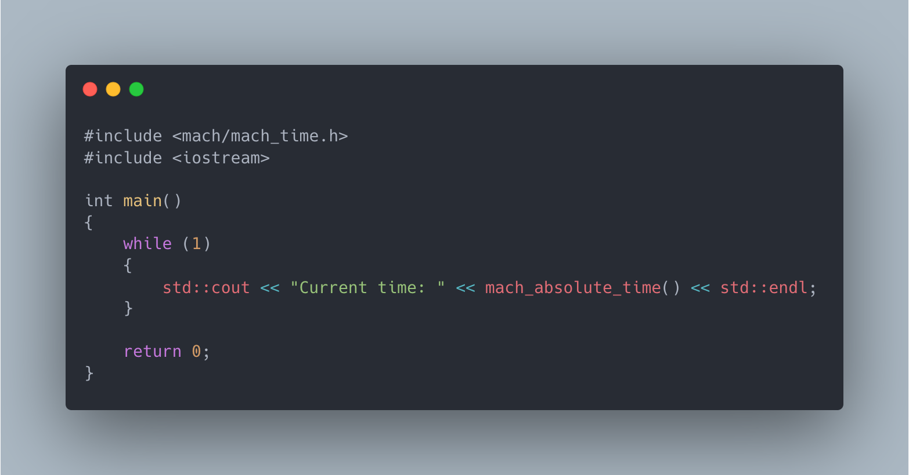
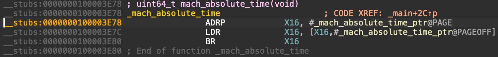
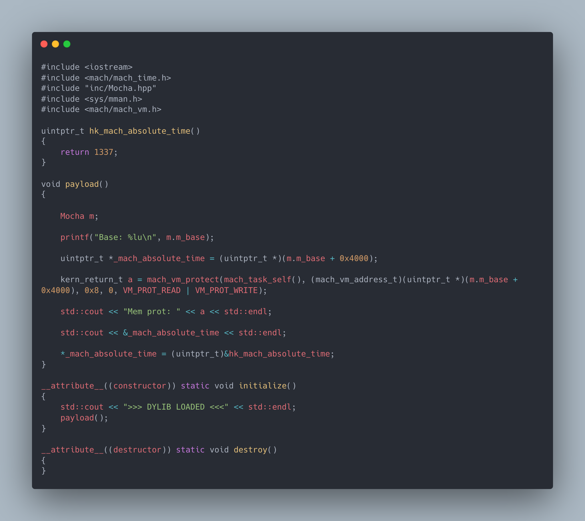

Hello,

Today we're going to be exploring how to exploit a flaw in MacOS system functions that allows us to replace, and ultimately hook the stub (representation in our target binary).

For this example, we'll be working with a very basic application that returns the current **mach\_absolute\_time** to a **cout** call.

Here's the code we're going to be using to test.

To get a deeper look into the program we're going to also be using IDA to assist in reverse engineering the function stubs.

Here's the assembly representation of the **mach\_absolute\_time** function stub, as you can see it's simply a wrapper method around a function called from a function pointer (**\_mach\_absolute\_time\_ptr**), this is our target.

  
Taking note of the ***mach*absolute\_time\_ptr** address (**0x4000**) we'll create a small dylib to perform memory manipulation inside our demonstration process.

**IMPORTANT NOTE** in some instances (notably here) our arm64 mach-o binaries will not produce a **\_\_la\_symbol\_ptr** region, and the \_\_got region will be marked as READONLY, so we may need to make a **mach\_vm\_protect** call to overwrite the page permissions.

I'll be using my OSX memory manipulation library "[Mocha](https://github.com/ItsJustMeChris/m0ch4)" to simplify the code required here.

With the code seen above, we're able to replace the **mach\_absolute\_time** function stub, allowing us to return 1337 from it, this is seen from the continuous loop output.

With this, you can simply call mach\_absolute\_time from our dylib and it will serve as a 'hook', where we've intercepted the source programs system call, and replaced it with our own, and still provide the program with its desired or expected return values.
